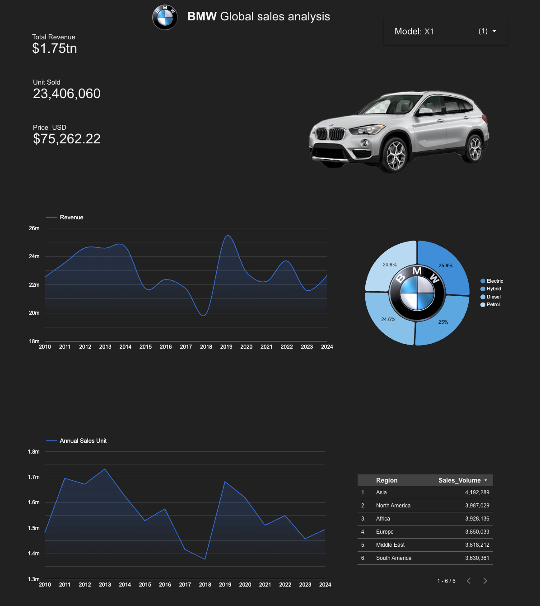

# BMW_Global_sales_analysis
End-to-end data analytics project using BigQuery, SQL, and Looker Studio.

#  Global BMW Sales Analytics Dashboard (2010-2024)




## 📊 Project Overview
This project analyzes BMW's global sales performance over 14 years to understand market shifts towards electric vehicles and regional revenue dominance. The dashboard acts as a strategic tool for visualizing high-value sales trends across 11 distinct car models.

**Live Dashboard:** [Link to your Looker Studio Report]

## 🛠️ Tech Stack
* **Database:** Google BigQuery (SQL)
* **Visualization:** Google Looker Studio
* **Data Processing:** SQL (ETL, Cleaning, Aggregation)
* **Asset Hosting:** GitHub (for dynamic image rendering)

## 💡 Key Features
* **Dynamic Visuals:** Implemented `CASE` logic to render model-specific car images that update instantly based on user filtering.
* **Revenue Intelligence:** Calculated over **$1.75 Trillion** in total analyzed revenue with regional breakdowns.
* **Market Shift Analysis:** Visualized the adoption trend of Hybrid and Electric vehicles (25% market share) vs. traditional Diesel/Petrol.

## 📈 Technical Implementation
The data was processed in BigQuery using SQL to clean 1M+ records and calculate revenue tiers. 

```sql
-- Sample Logic: Dynamic Image Linking
CASE 
  WHEN Model LIKE "%3 Series%" THEN "[https://github.com/BanerjeeAvinaba/BMW_cars_image/.../3series.png](https://github.com/BanerjeeAvinaba/BMW_cars_image/.../3series.png)"
  WHEN Model LIKE "%M3%" THEN "[https://github.com/BanerjeeAvinaba/BMW_cars_image/.../m3.png](https://github.com/BanerjeeAvinaba/BMW_cars_image/.../m3.png)"
  ELSE "Placeholder_URL" 
END
